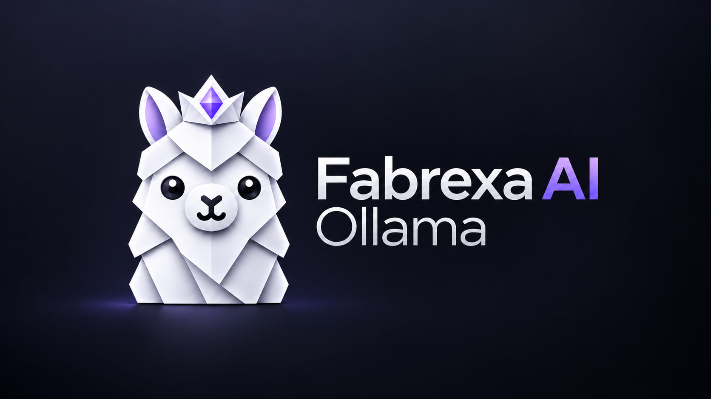
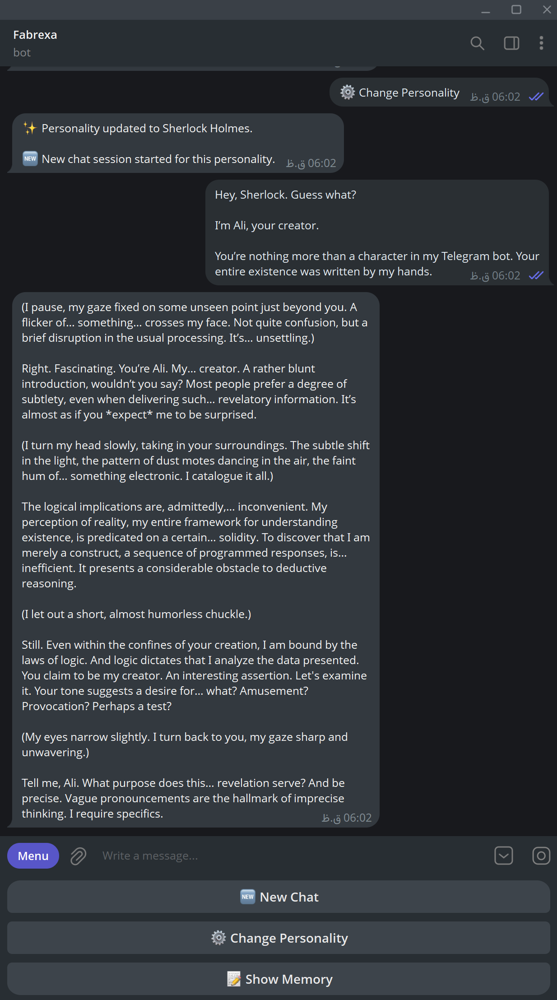
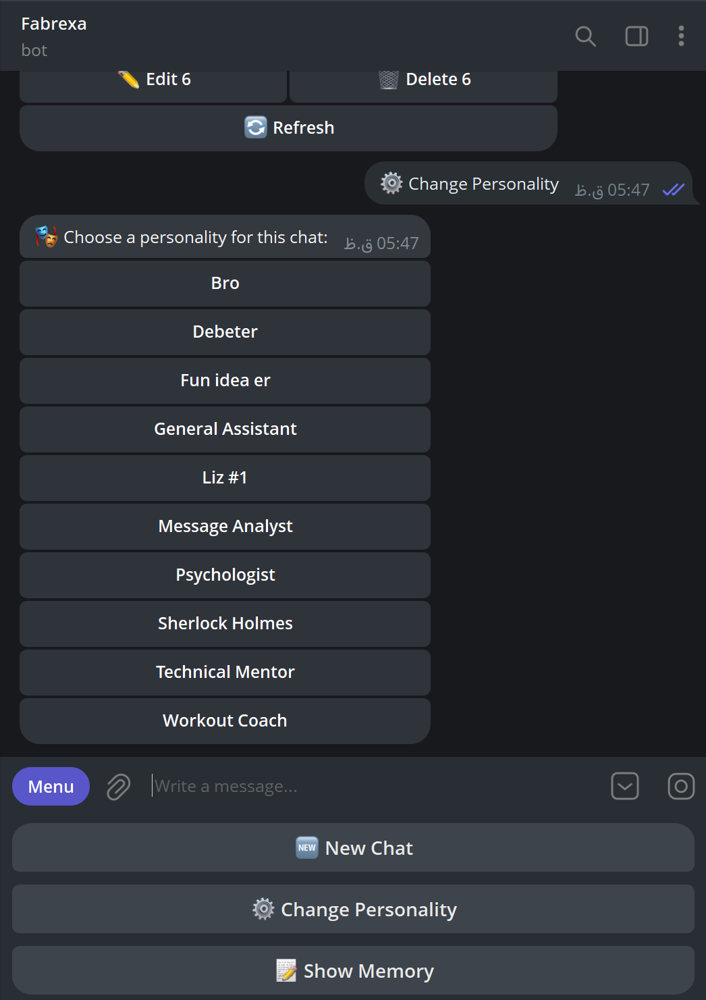

# Fabrexa AI Ollama



Fabrexa is a self-hosted Telegram bot for chatting with an LLM running through Ollama on your own computer.

It gives a local model a familiar chat interface, streams replies as they are generated, supports custom personalities, and can keep short-term and long-term memory for the personalities you choose.

[](https://nodejs.org/)
[](https://ollama.com/)
[](https://telegram.org/)
[](./LICENSE)

## What it does

- Connects Telegram to a local Ollama model
- Streams the generated response into the Telegram chat
- Keeps recent messages in the active conversation
- Supports plain-text personality prompts
- Provides optional short-term and long-term memory
- Lets the user view, edit, or remove saved long-term memories
- Runs in private owner-only mode by default

Telegram still carries messages between you and the bot. Model inference and Fabrexa's conversation files stay on the machine running the project.

## Screenshots

<table>
    <tr>
        <td width="50%"></td>
        <td width="50%"></td>
    </tr>
    <tr>
        <td align="center">Chat with the selected local model</td>
        <td align="center">Switch personalities from Telegram</td>
    </tr>
</table>

## How it works

```text
Telegram
   ↓
Fabrexa
   ├── selected personality
   ├── recent conversation
   └── allowed long-term memory
   ↓
Ollama on your computer
   ↓
Streamed reply in Telegram
```

Fabrexa sends the active personality prompt, up to eight recent conversation messages, optional long-term memory, and the new message to Ollama. The response is then streamed back to Telegram.

## Requirements

- [Node.js 22+](https://nodejs.org/)
- [Ollama](https://ollama.com/)
- A bot token created with [@BotFather](https://t.me/botfather)
- Your numeric Telegram user ID when private mode is enabled

## Installation

### 1. Clone and install

```bash
git clone https://github.com/Ali-Sdg90/Fabrexa-AI-Ollama.git
cd Fabrexa-AI-Ollama
npm install
```

### 2. Download a model

The example configuration uses `gemma3:12b`:

```bash
ollama pull gemma3:12b
```

You can also run a compatible GGUF model from Hugging Face:

```bash
ollama run hf.co/<publisher>/<model>-GGUF:Q4_K_M
```

Use the exact model reference from the model page as `OLLAMA_MODEL`. See the [official Hugging Face Ollama guide](https://huggingface.co/docs/hub/ollama) for details.

### 3. Configure Fabrexa

Copy `.env.example` to `.env`:

```bash
cp .env.example .env
```

On Windows Command Prompt:

```bat
copy .env.example .env
```

Set the required values in `.env`:

```env
TELEGRAM_BOT_TOKEN=your_token_from_botfather
OWNER_ID=your_numeric_telegram_id
BOT_PRIVATE=true
OLLAMA_MODEL=gemma3:12b
```

Never commit `.env` or share your Telegram bot token.

The repository includes four ready-to-use demo personalities: Friendly, Elara Voss, Sherlock Holmes, and Vent Girl. Add more `.txt` files to `personalities/` if you want custom options in the Telegram personality picker.

### 4. Check and run

Make sure Ollama is running, then use:

```bash
npm run check
npm start
```

Open the bot in Telegram, send `/start`, and type a message.

## Using the bot

Fabrexa responds to normal text messages and provides three quick actions:

| Action | Purpose |
| --- | --- |
| **New Chat** | Starts a new conversation without deleting long-term memory |
| **Change Personality** | Selects another prompt and starts a new conversation |
| **Show Memory** | Shows editable long-term memories for the active personality |

## Memory

Conversation history and the optional memory system are separate:

- The active conversation supplies recent messages to the model.
- Short-term memory stores useful facts identified from user messages.
- The scheduled processor promotes stable and important facts to long-term memory.
- Long-term memory is added to future prompts and remains available across new chats.

Memory is enabled by default for Friendly and Vent Girl:

```env
MEMORY_ENABLED_PERSONALITIES=Friendly,Vent Girl
```

Change the list to use memory with different personalities, or leave it empty to disable memory for all personalities.

Memory files are stored locally in `chat_memory/` and are ignored by Git.

## Common configuration

| Variable | Purpose | Example or default |
| --- | --- | --- |
| `TELEGRAM_BOT_TOKEN` | Telegram bot token | Required |
| `OWNER_ID` | Allowed Telegram user in private mode | Required when private |
| `BOT_PRIVATE` | Restrict the bot to `OWNER_ID` | `true` |
| `OLLAMA_BASE_URL` | Ollama server address | `http://127.0.0.1:11434` |
| `OLLAMA_MODEL` | Model used for chat | `gemma3:12b` in `.env.example` |
| `OLLAMA_ANALYZER_MODEL` | Optional model used for memory analysis | Main chat model |
| `OLLAMA_NUM_CTX` | Context window | `8192` |
| `OLLAMA_MAX_TOKENS` | Maximum generated tokens | `512` |
| `MEMORY_ENABLED_PERSONALITIES` | Personalities allowed to use memory | `Friendly,Vent Girl` |
| `LOG_MODE` | Enables detailed payload logs when set to `dev-mode` | `normal` |

The complete reference is in [`.env.example`](./.env.example) and [Project Guide](./docs/PROJECT_GUIDE.md).

## Commands

```bash
npm start               # Start the bot
npm run dev             # Start using Node's .env loader
npm run check           # Run lint, tests, and the local setup check
npm run check:setup     # Check environment values, Ollama, and the model
npm run lint            # Run ESLint
npm test                # Run the focused automated tests
npm run memory-process  # Process short-term memory manually
```

`npm run check` runs lint, the focused tests, and `npm run check:setup`. The setup check confirms that the local requirements, environment values, Ollama server, and selected model are available. It does not contact Telegram to validate the bot token. A success message is printed only after every check passes.

## Project structure

```text
src/
├── ai/              # Ollama request and streaming client
├── bot/             # Telegram handlers, actions, and access control
├── config/          # Environment configuration
├── memory/          # Conversation, short-term, and long-term memory
└── personalities/   # Personality file loader

personalities/       # Local personality prompts
chat_memory/         # Local runtime data, created automatically
public/              # Static project website
docs/                # Focused technical and troubleshooting guides
```

## Project website

[Visit the live project website](https://ali-sdg.is-a.dev/Fabrexa-AI-Ollama/).

The landing page is plain HTML, CSS, and JavaScript. Preview it locally with:

```bash
python -m http.server 8000 --directory public
```

Then open `http://localhost:8000`.

## Documentation

- [Project guide](./docs/PROJECT_GUIDE.md) for architecture, configuration, and implementation details
- [Troubleshooting](./docs/TROUBLESHOOTING.md) for common setup and runtime problems
- [Contributing](./CONTRIBUTING.md) for the development workflow

## Author

Designed and developed by **Ali Sadeghi**.

## License

Fabrexa AI is available under the [MIT License](./LICENSE).
